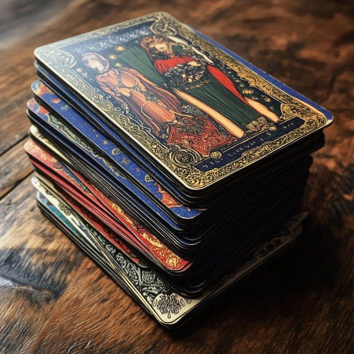

<h1>(Import) Remove Subalias</h1>

Allows users (requires administrative privileges) to remove imported decks from SVAR

## Usage
`!deckofcards import remove [deck name]`
- `deck name`
    - Required
    - Name of deck to be removed from SVAR